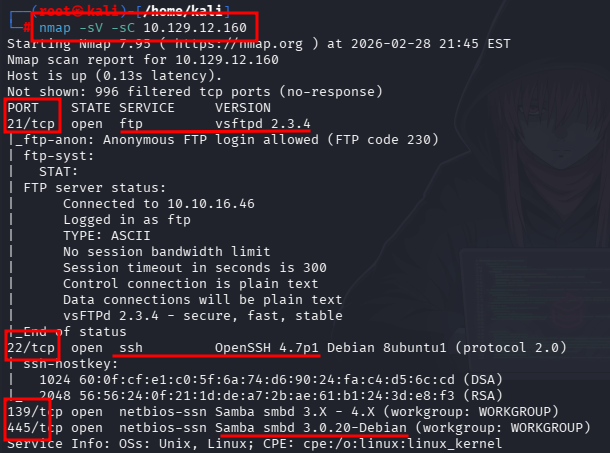

# 🚩 WriteUp: Lame Machine

## Resolution:
**1. Enumeration with nmap:**

First, we use nmap to map all open ports on the victim machine (10.129.12.160). We use the -sV flag to detect the service versions and -sC to run default scripts to gather additional information.



[more details of nmap report](resource_lame/nmap.md)

**2. Exploit VSFTPd version 2.3.4:**

We successfully located four open ports. Our initial focus was on the FTP (21) port because its service version has a well-known backdoor exploit.

https://www.exploit-db.com/exploits/17491


**3. Using metasploit for exploit VSFTPd:**

Using Metasploit, we prepared the attack, ensuring all parameters were correctly configured. We modified the RHOSTS parameter accordingly. 


However, the exploit failed. By analyzing the exploit code, we identified that error ID 331 indicates the server is not responding as expected, as it requires a password.


**4. Exploit Samba version 3.0.20:**

Next, we attempted an alternative attack vector via the Samba service on the SMB ports (445 and 139).

https://www.exploit-db.com/exploits/16320


**5. Using metasploit for exploit Samba:**

Again, using Metasploit, we reviewed and modified the required parameters, specifically setting RHOSTS and LPORT. 


This time, the exploit worked successfully, granting us a reverse shell as the root user.


**6. Phase Post-Explotation looking for flags:**

Once inside the system, we proceeded to locate the flags. To do this, we used find commands to search for common flag filenames typically used in these environments.
```bash
pwd
find . -name "user*.txt"
find . -name "admin*.txt"
find . -name "root*.txt"
```


**7. Flags:**

user.txt: c4c90e0cef57469fd2e3dc3f39b4f707

root.txt: a8dd8096206146b4f9629a97fddfdd50